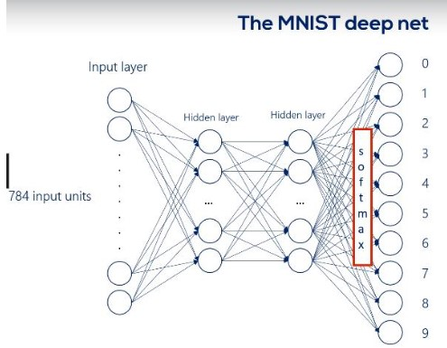

# DeepLearning
CNN

    

        <b style="text-shadow: 0 0.15rem 0.25rem orange;">Classifying on the MNIST dataset</b>
    

    

        

            
The dataset is called MNIST  and refers to handwritten digits recognition.  The dataset provides 70,000 images (28x28 pixels) of handwritten digits (0-9).

            <ul style=" list-style-type: none;font-size: 1.55rem; margin-right: 1.5rem">
            <b><u style="text-shadow: 0 0.15rem 0.25rem orange;font-size: 1.75rem;">
                The goal is to write an algorithm that detects which digit is written.</u></b>    
        <li>Since there are only 10 digits (0-9), 
             <u style="text-shadow: 0 0.15rem 0.25rem orange;
                font-size: 1.55rem;">this is a classification problem with 10 classes.</u> </li> 
        <li>By leveraging the power of <i style="color:orange; font-size: 20px">TensorFlow 2.0</i> this project aims to create a Convolutional Neural Network (CNN) which will solve the MNIST classification problem</li></ul>
        

        

            
        

    

    

 <!-- GLOWING DIVIDER  -->
    

        

            

                <u style="text-shadow: 0 0.15rem 0.25rem orange;font-size: 1.75rem;">Deep Neural Networks (Deep Nets):</u>  
                Deep Neural Networks, often referred to as deep nets, are a class of artificial neural networks that consist of multiple layers. These layers include an input layer, one or more hidden layers, and an output layer. The "deep" in deep nets signifies the inclusion of multiple hidden layers, which allows these networks to learn intricate patterns and representations from complex data. Each layer in a deep net performs a set of mathematical operations to transform the input data and extract progressively more abstract features.  
                <u style="text-shadow: 0 0.15rem 0.25rem orange;font-size: 1.75rem;">Convolutional Neural Networks (CNNs):</u>  
                Convolutional Neural Networks (CNNs) are a specialized type of deep neural network designed primarily for processing grid-like data, such as images and videos. CNNs are particularly effective for tasks like image classification, object detection, and image segmentation. The key innovation in CNNs is the use of convolutional layers, which apply filters or kernels to input data, enabling the network to automatically learn hierarchical features from the data.
            

        

        

             

            
        

        

    <ul style="background: white; color: darkblue; padding: 1rem; text-align: center; list-style-type: none; border-radius: 20px">
        <b style="font-size: 2.5rem; color: orange">The MNIST action plan:</b> 
        <li style="background: darkblue; color: white; text-align: left; padding-left: 2rem; 
                   padding-top:1rem; border-top-right-radius: 20px; border-top-left-radius: 20px; margin-top:0.5rem"><b><i style="color: orange">1.)</i> Prepare our data and preprocess it.  &nbsp;&nbsp;&nbsp;&nbsp;&nbsp;&nbsp;Create training, validation, and test datasets.</b></li>
        <li style="background: darkblue; color: white; text-align: left; padding-left: 2rem"><b><i style="color: orange">2.)</i> Outline the model, and choose the activation functions.</b></li>
        <li style="background: darkblue; color: white; text-align: left; padding-left: 2rem"><b><i style="color: orange">3.)</i> Set the appropriate advanced optimizers   &nbsp;&nbsp;&nbsp;&nbsp;&nbsp;&nbsp;and the loss function.</b></li>
        <li style="background: darkblue; color: white; text-align: left; padding-left: 2rem"><b><i style="color: orange">4.)</i> Make it learn. 
            <i style="font-size: 1.3rem
                      "> &nbsp;&nbsp;&nbsp;&nbsp;&nbsp;&nbsp;[The algorithm will back propagate its way to accuracy, &nbsp;&nbsp;&nbsp;&nbsp;&nbsp;&nbsp;validating at each epoch.]</i></b></li>
        <li style="background: darkblue; color: white; text-align: left; padding-left: 2rem; 
                   padding-bottom:1rem; border-bottom-right-radius: 20px; border-bottom-left-radius: 20px"><b><i style="color: orange">5.)</i> Test the accuracy of the model.</b></li>
        </ul>

       
        

        

    

 <!-- GLOWING DIVIDER  -->
    

    

         In the process of developing a Convolutional Neural Network (CNN) for the classification of MNIST handwritten digits, I'm delving into the foundational concept of tensors. Tensors, which are multi-dimensional arrays, serve as the building blocks for representing data, weights, and computations within neural networks.   The focus lies on the renowned MNIST dataset, a collection of grayscale images depicting digits 0 to 9. This dataset is a cornerstone in the field of machine learning, often employed to assess algorithm performance.   Facilitating this endeavor is TensorFlow 2.0, a cutting-edge open-source deep learning framework. Its user-friendly interfaces streamline the creation of complex models, including CNNs, by offering high-level APIs and features like automatic differentiation. TensorFlow 2.0's role in this project highlights its significance as a preferred tool for researchers and developers aiming to achieve image classification excellence.

    

 <!--le dots-->
    

 <!--le dots-->
    

    

  <!-- GLOWING DIVIDER  -->

